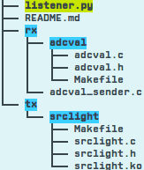

# Localization without Modulation
#### File Structure  
.  

### Tx (Transmitter BeagleBone node)
Contains kernel module _srclight_.
This module is used to switch the high power LED on.
(To be compiled on the BeagleBone).

### Rx (Receiver BeagleBone node)

##### Kernel Module for ADC values
Directory **adcval** contains code for a kernel module which can be compiled to obtain raw values from the ADC.
The module provides values both from the photodiode as well as the LED (used as a receiver).
These kernel values can be accessed from user space by reading the files:  

_/proc/adcval/lval_   (received power by LED)  
_/proc/adcval/pval_   (received power by photodiode)  

##### Sender program
The C program *adcval\_sender.c* reads these ADC values from the above mentioned files.
The BeagleBone platform also has an Android phone attached to it for orientation information.
The phone is connected to the platform via a USB cable.
This USB connection also acts as a network interface for the Beaglebone.
An Android application [SensorUDP](https://play.google.com/store/apps/details?id=jp.ac.ehime_u.cite.sasaki.SensorUdp&hl=en) is used to send orientation information to the BeagleBone at port 12345 using UDP.
The orientation values received from the phone are processed by this program in a separate thread.  

Both values from the ADC, and the orientation values are sent to the port 7891 of a connected PC/laptop via UDP.

### Listener script (PC/Laptop)
**(requires libraries matplotlib, numpy)**

Information is received from the Beaglebone by listening on the port 7891.
A python script *listener.py* reads the UDP packets from this port, processes them for localization, and plots them using *matplotlib*.

## Setup & Installation
Tx:
1. Compile and load the *srclight* module for the Transmitter.  

Rx:
1. Connect the Receiver to the PC/Laptop via a USB cable.  
2. Compile and load the *adcval* module for the Receiver.  
3. Check if the files /proc/adcval/lval & /proc/adcval/pval exist.  
4. Add these lines to the file : **\etc\network\interfaces**   

  iface usb1 inet static  
    address *(choose an IP address for the BeagleBone)*  

5. Connect the Android phone to the Receiver.  
6. Bring the USB network interface up using the command :  

  **ifup usb1**.  

7. Configure SensorUDP application on the Android phone using the chosen IP address and port 12345, and start the transmission.  
8. Compile and execute the *adcval_sender.c* program in the background.
9. Execute the *listener.py* script on the PC/Laptop.  
